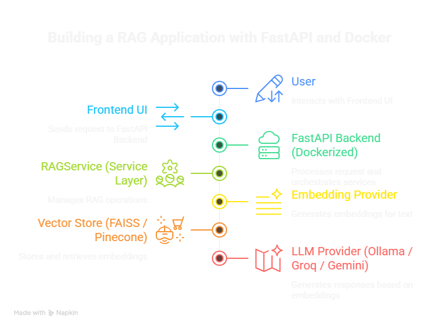
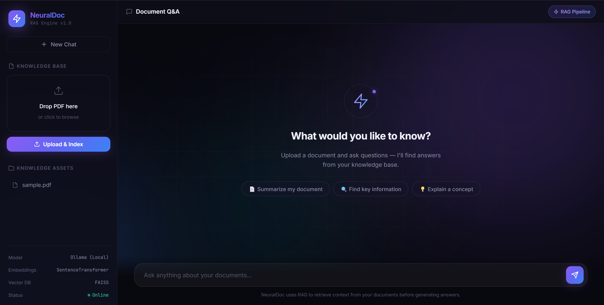
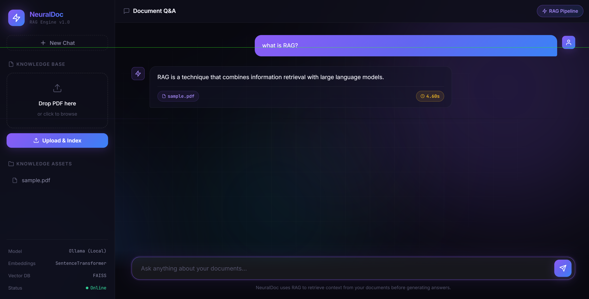

# NeuralDoc AI — Production-Ready RAG SaaS Platform

🚀 Live Demo: [Your Deployment Link Here]  
🐳 Dockerized | 🔐 JWT Secured | ☁ Pinecone Integrated | 🤖 Multi-LLM Support  

---

## 📌 Overview

NeuralDoc AI is a production-ready Retrieval-Augmented Generation (RAG) platform that enables users to upload documents and query them using Large Language Models (LLMs).

Unlike basic RAG demos, this system is designed with real-world engineering principles including:

- Service-layer architecture
- LLM provider abstraction
- Cloud vector database integration
- Authentication
- Dockerized deployment
- Observability tracking

This project simulates a real SaaS AI backend system.

---

## 🧠 Problem Statement

Large Language Models:

- Hallucinate without context
- Cannot access private documents
- Lack retrieval memory
- Are not production-secure by default

Most student RAG projects:
- Use global variables
- Lack authentication
- Do not scale
- Are not deployable
- Have no system design thinking

NeuralDoc AI solves these problems by providing a modular, secure, scalable RAG backend system.

---

## 🏗 System Architecture

Key Design Decisions:

- Service layer removes global state
- LLM abstraction allows provider switching via environment variables
- Cloud vector database supports scaling
- JWT authentication protects endpoints
- Docker ensures deployment consistency

---

## 🔧 Tech Stack

**Backend**
- FastAPI
- Python
- SQLAlchemy
- JWT Authentication

**AI & ML**
- Sentence Transformers (all-MiniLM-L6-v2)
- Pinecone (Cloud Vector DB)
- FAISS (Local Dev)
- Ollama (Local LLM)
- Groq / Gemini (Cloud LLM)

**DevOps**
- Docker
- Environment variable validation
- MLflow (observability)

---

## 🚀 Core Features

✅ Document upload & indexing  
✅ Semantic similarity retrieval  
✅ Multi-LLM provider support  
✅ Cloud vector DB integration  
✅ JWT-protected endpoints  
✅ Dockerized deployment  
✅ Environment-based configuration  
✅ Clean Git versioning workflow  

---

## 🔐 Security

- Password hashing (bcrypt)
- JWT-based authentication
- Protected endpoints (/ask, /upload)
- Config validation on startup
- No hardcoded secrets

---

## 📈 Version Evolution

| Version | Feature |
|----------|----------|
| v1.0 | Core RAG implementation |
| v1.1 | Observability with MLflow |
| v2.0 | Persistent FAISS storage |
| v2.1 | Service layer refactor |
| v3 | LLM abstraction layer |
| v4 | Pinecone cloud integration |
| v5 | JWT authentication |

This project evolved incrementally using feature branches and pull request workflow.

---

## ⚖️ Local vs Production Strategy

| Component | Local | Production |
|------------|--------|-------------|
| LLM | Ollama | Groq / Gemini |
| Vector DB | FAISS | Pinecone |
| Deployment | Localhost | Docker Cloud Deploy |

This separation ensures development flexibility and production scalability.

---

## 📊 Scaling Considerations

- Stateless backend design
- External vector DB scaling
- Provider abstraction allows LLM switching
- Docker-ready for horizontal scaling
- Authentication supports multi-user extension

---

## 🖥 Demo Flow

1. Register
2. Login
3. Upload document
4. Ask contextual questions
5. Receive AI-generated answer grounded in retrieved context

### 📄 Upload Document
Drop a PDF into the Knowledge Base panel and click **Upload & Index**.

---

###  💬 Ask Contextual Questions
Type your question in the chat input and hit send.

## 🎯 What I Learned

- Production-ready RAG architecture
- AI system design tradeoffs
- LLM abstraction patterns
- Cloud vector database integration
- Docker deployment debugging
- Git branch discipline and versioning strategy
- Handling quota limits and provider fallback

---

## 📌 Future Improvements

- Rate limiting per user
- Usage tracking dashboard
- Streaming responses
- Background embedding worker
- Admin analytics panel

---

## 👨‍💻 Author

Uday Bansal  
B.Tech Computer Science (AIML)  
Aspiring Full Stack AI Engineer