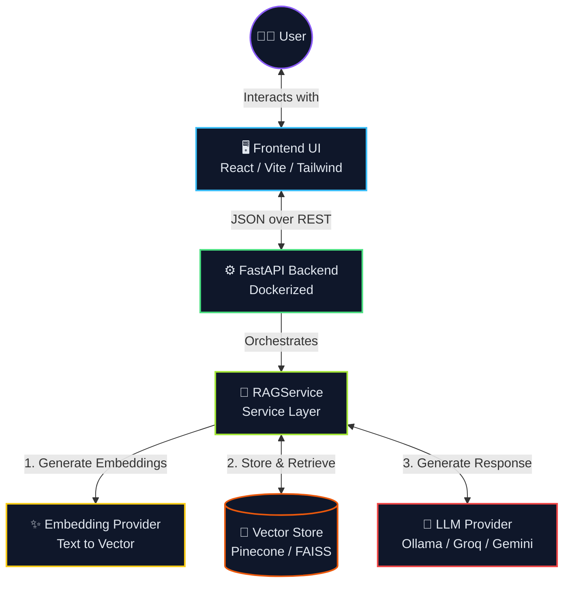

# 🚀 Full-Stack RAG System (Retrieval-Augmented Generation)

Welcome to the **Full-Stack RAG System**! This repository houses a production-ready Web Application and API configured to deliver intelligent, context-aware AI responses using a Retrieval-Augmented Generation pipeline.

---

## 📸 System Architecture

Here is the high-level flow of how data and requests move through the RAG system:



### 🧩 Components Breakdown

1. **Frontend UI**: Built with React, Vite, and Tailwind CSS. It handles user authentication (via Supabase) and provides the chatbot/search interface.
2. **FastAPI Backend**: A robust, Dockerized Python backend that manages authentication, routes, and core business logic.
3. **RAG Service (Service Layer)**: The brain of the operation. It intercepts user queries and orchestrates the embedding, retrieval, and generation steps.
4. **Embedding Provider**: Converts textual context and user queries into high-dimensional vector embeddings.
5. **Vector Store**: Uses Pinecone (or FAISS) to efficiently store and query embeddings based on semantic similarity.
6. **LLM Provider**: Connects to advanced Language Models (like Gemini, Groq, or localized Ollama) to synthesize the retrieved context and generate a conversational answer.

---

## 🛠️ Technology Stack

### Frontend
- **React.js & Vite**: Fast, modern UI development.
- **Tailwind CSS**: Utility-first styling (configured via `tailwind.config.js`).
- **Supabase**: Authentication and user session hooks (`use-auth.ts`).

### Backend (Production-level-RAG-system)
- **FastAPI**: High-performance asynchronous API framework.
- **Pinecone**: Cloud-native Vector Database for storing document embeddings.
- **Python 3.10+**: Core backend runtime.
- **Docker**: Containerized deployment (`Dockerfile`).

---

## 📂 Project Structure

```text
📦 my-vly-project
 ┣ 📂 Production-level-RAG-system/   # FastAPI Python Backend
 ┃ ┣ 📂 app/                         # Application logic
 ┃ ┃ ┣ 📂 api/                       # API routing and auth
 ┃ ┃ ┣ 📂 core/                      # Global config, DB connection, logging
 ┃ ┃ ┣ 📂 models/                    # Data models (SQL/Pydantic)
 ┃ ┃ ┗ 📂 services/                  # Business Logic (RAG, Embeddings, LLM)
 ┃ ┣ 📂 data/                        # Ingestion scripts (index_document.py)
 ┃ ┗ 📜 Dockerfile                   # Backend Dockerization
 ┣ 📂 src/                           # React Frontend Source files
 ┃ ┣ 📂 components/                  # Reusable UI components & dialogs
 ┃ ┣ 📂 pages/                       # Login, SignUp, Landing pages
 ┃ ┗ 📂 providers/                   # Context providers (e.g., AuthProvider)
 ┣ 📜 index.html                     # Vite entry point
 ┣ 📜 package.json                   # JS/TS dependencies
 ┗ 📜 .gitignore                     # Ignored tracked files
```

---

## 🚦 Getting Started

### Prerequisites
- [Node.js](https://nodejs.org/en/) (v16+)
- [Python](https://www.python.org/downloads/) (3.10+)
- [Docker](https://www.docker.com/) (Optional, but recommended for backend)

### 1. Setup Frontend Context
```bash
# Install dependencies
npm install

# Run the development server
npm run dev
```

### 2. Setup FastAPI Backend
```bash
cd Production-level-RAG-system

# Create a virtual environment
python -m venv venv
source venv/Scripts/activate  # On Windows

# Install Python dependencies
pip install -r requirements.txt

# Start the FastApi Server
uvicorn app.main:app --reload
```
*(Alternatively, you can build and run the provided Docker container inside the backend directory!)*

---

## 🤝 Contributing
1. Create your Feature Branch (`git checkout -b feature/AmazingFeature`)
2. Commit your Changes (`git commit -m 'Add some AmazingFeature'`)
3. Push to the Branch (`git push origin feature/AmazingFeature`)
4. Open a Pull Request!
